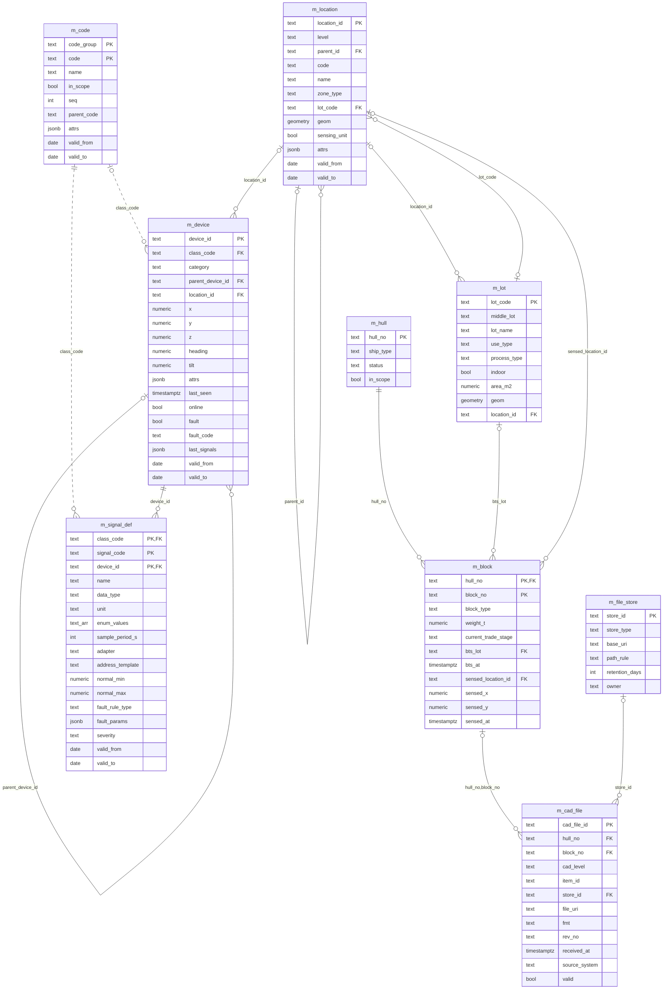
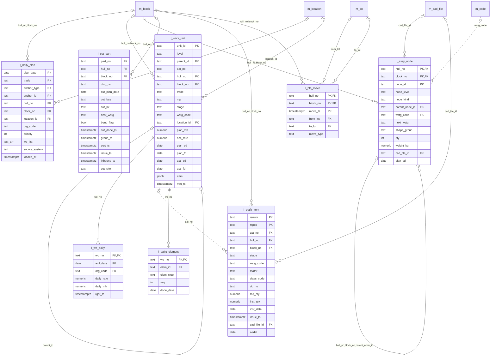
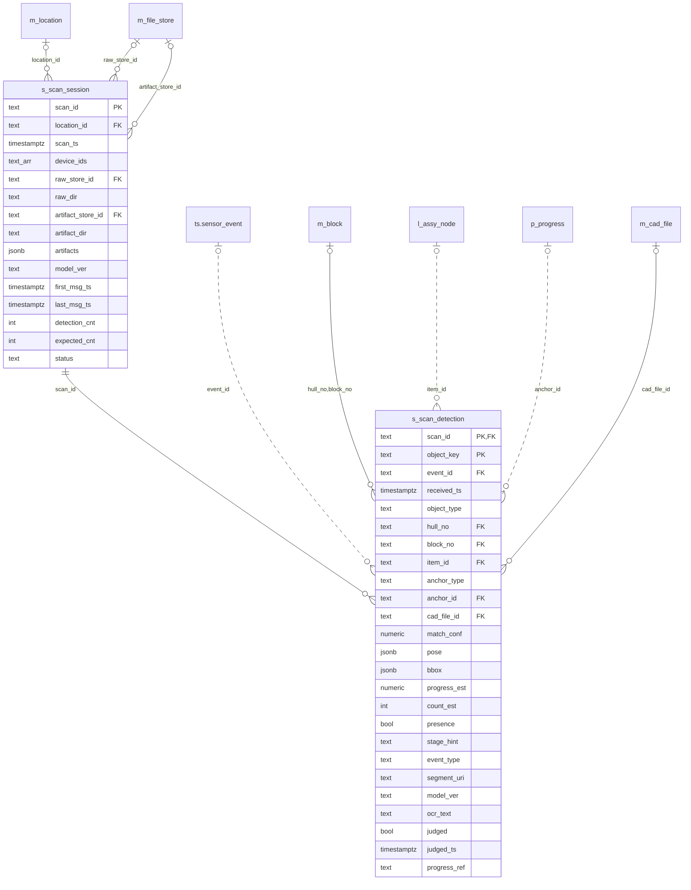
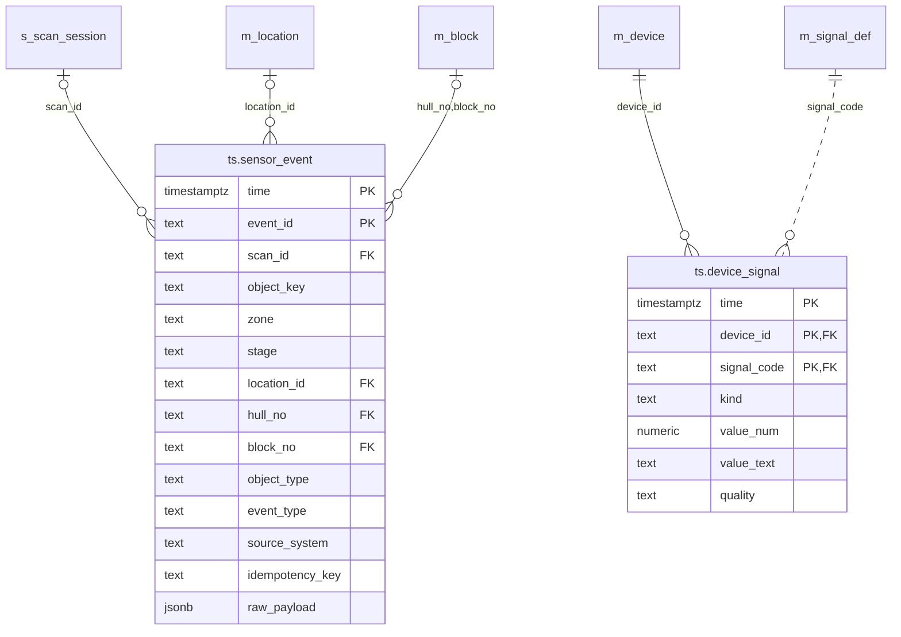
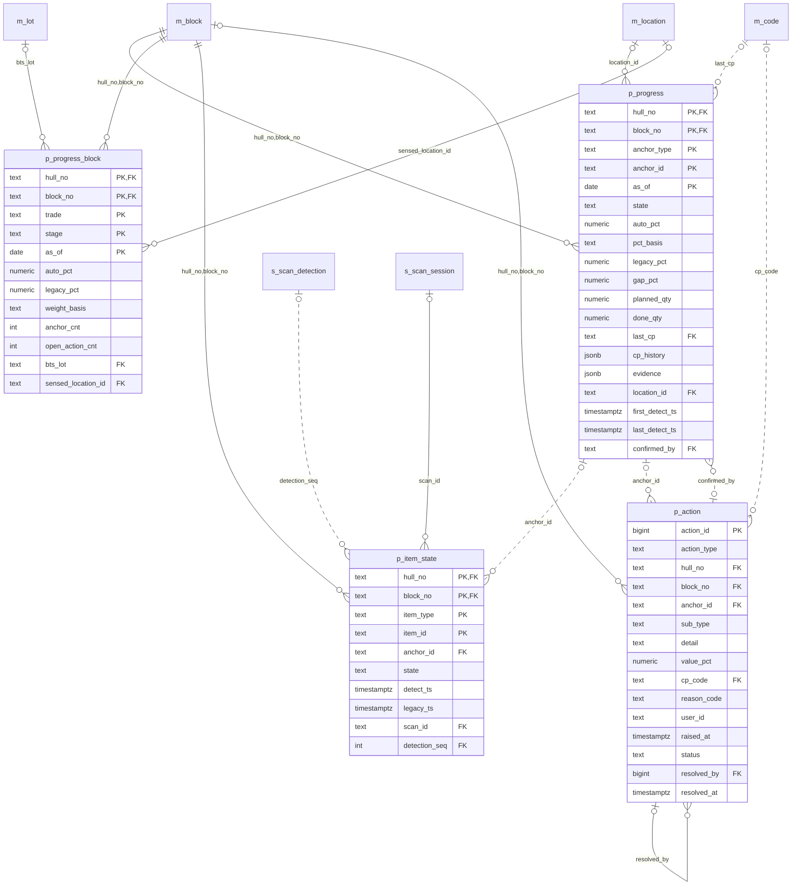

# Hot DB 논리 모델 v9 ERD

원본: Confluence `[공통] 내업 Hot DB 논리 모델 — 테이블 상세` (334201522). 점선 = 제약 없는 논리 참조.

## 전체 관계

```mermaid
erDiagram
    m_hull["m_hull"]
    m_block["m_block"]
    m_location["m_location"]
    m_lot["m_lot"]
    m_device["m_device"]
    m_signal_def["m_signal_def"]
    m_file_store["m_file_store"]
    m_cad_file["m_cad_file"]
    m_code["m_code"]
    l_daily_plan["l_daily_plan"]
    l_work_unit["l_work_unit"]
    l_wo_daily["l_wo_daily"]
    l_assy_node["l_assy_node"]
    l_cut_part["l_cut_part"]
    l_outfit_item["l_outfit_item"]
    l_paint_element["l_paint_element"]
    l_bts_move["l_bts_move"]
    s_scan_session["s_scan_session"]
    s_scan_detection["s_scan_detection"]
    ts_device_signal["ts.device_signal"]
    ts_sensor_event["ts.sensor_event"]
    p_progress["p_progress"]
    p_progress_block["p_progress_block"]
    p_item_state["p_item_state"]
    p_action["p_action"]
    m_hull ||--o{ m_block : "hull_no"
    m_lot |o--o{ m_block : "bts_lot"
    m_location |o--o{ m_block : "sensed_location_id"
    m_location |o--o{ m_location : "parent_id"
    m_lot |o--o{ m_location : "lot_code"
    m_location |o--o{ m_lot : "location_id"
    m_code |o..o{ m_device : "class_code"
    m_device |o--o{ m_device : "parent_device_id"
    m_location |o--o{ m_device : "location_id"
    m_code ||..o{ m_signal_def : "class_code"
    m_device ||--o{ m_signal_def : "device_id"
    m_block |o--o{ m_cad_file : "hull_no,block_no"
    m_file_store |o--o{ m_cad_file : "store_id"
    m_block |o--o{ l_daily_plan : "hull_no,block_no"
    m_location |o--o{ l_daily_plan : "location_id"
    l_work_unit |o--o{ l_work_unit : "parent_id"
    m_block |o--o{ l_work_unit : "hull_no,block_no"
    m_location |o--o{ l_work_unit : "location_id"
    l_work_unit ||--o{ l_wo_daily : "wo_no"
    m_block ||--o{ l_assy_node : "hull_no,block_no"
    l_assy_node |o--o{ l_assy_node : "hull_no,block_no,parent_node_id"
    m_code |o..o{ l_assy_node : "wstg_code"
    m_cad_file |o--o{ l_assy_node : "cad_file_id"
    m_block |o--o{ l_cut_part : "hull_no,block_no"
    l_work_unit |o..o{ l_outfit_item : "act_no"
    m_block |o--o{ l_outfit_item : "hull_no,block_no"
    m_cad_file |o--o{ l_outfit_item : "cad_file_id"
    l_work_unit ||--o{ l_paint_element : "wo_no"
    m_block ||--o{ l_bts_move : "hull_no,block_no"
    m_lot |o--o{ l_bts_move : "from_lot"
    m_lot |o--o{ l_bts_move : "to_lot"
    m_location |o--o{ s_scan_session : "location_id"
    m_file_store |o--o{ s_scan_session : "raw_store_id"
    m_file_store |o--o{ s_scan_session : "artifact_store_id"
    s_scan_session ||--o{ s_scan_detection : "scan_id"
    ts_sensor_event |o..o{ s_scan_detection : "event_id"
    m_block |o--o{ s_scan_detection : "hull_no,block_no"
    l_assy_node |o..o{ s_scan_detection : "item_id"
    p_progress |o..o{ s_scan_detection : "anchor_id"
    m_cad_file |o--o{ s_scan_detection : "cad_file_id"
    m_device ||--o{ ts_device_signal : "device_id"
    m_signal_def ||..o{ ts_device_signal : "signal_code"
    s_scan_session |o--o{ ts_sensor_event : "scan_id"
    m_location |o--o{ ts_sensor_event : "location_id"
    m_block |o--o{ ts_sensor_event : "hull_no,block_no"
    m_block ||--o{ p_progress : "hull_no,block_no"
    m_code |o..o{ p_progress : "last_cp"
    m_location |o--o{ p_progress : "location_id"
    p_action |o..o{ p_progress : "confirmed_by"
    m_block ||--o{ p_progress_block : "hull_no,block_no"
    m_lot |o--o{ p_progress_block : "bts_lot"
    m_location |o--o{ p_progress_block : "sensed_location_id"
    m_block ||--o{ p_item_state : "hull_no,block_no"
    p_progress |o..o{ p_item_state : "anchor_id"
    s_scan_session |o--o{ p_item_state : "scan_id"
    s_scan_detection |o..o{ p_item_state : "detection_seq"
    m_block |o--o{ p_action : "hull_no,block_no"
    p_progress |o..o{ p_action : "anchor_id"
    m_code |o..o{ p_action : "cp_code"
    p_action |o--o{ p_action : "resolved_by"
```

## M 기준정보

```mermaid
erDiagram
    m_hull["m_hull"] {
        text hull_no PK
        text ship_type
        text status
        bool in_scope
    }
    m_block["m_block"] {
        text hull_no PK,FK
        text block_no PK
        text block_type
        numeric weight_t
        text current_trade_stage
        text bts_lot FK
        timestamptz bts_at
        text sensed_location_id FK
        numeric sensed_x
        numeric sensed_y
        timestamptz sensed_at
    }
    m_location["m_location"] {
        text location_id PK
        text level
        text parent_id FK
        text code
        text name
        text zone_type
        text lot_code FK
        geometry geom
        bool sensing_unit
        jsonb attrs
        date valid_from
        date valid_to
    }
    m_lot["m_lot"] {
        text lot_code PK
        text middle_lot
        text lot_name
        text use_type
        text process_type
        bool indoor
        numeric area_m2
        geometry geom
        text location_id FK
    }
    m_device["m_device"] {
        text device_id PK
        text class_code FK
        text category
        text parent_device_id FK
        text location_id FK
        numeric x
        numeric y
        numeric z
        numeric heading
        numeric tilt
        jsonb attrs
        timestamptz last_seen
        bool online
        bool fault
        text fault_code
        jsonb last_signals
        date valid_from
        date valid_to
    }
    m_signal_def["m_signal_def"] {
        text class_code PK,FK
        text signal_code PK
        text device_id PK,FK
        text name
        text data_type
        text unit
        text_arr enum_values
        int sample_period_s
        text adapter
        text address_template
        numeric normal_min
        numeric normal_max
        text fault_rule_type
        jsonb fault_params
        text severity
        date valid_from
        date valid_to
    }
    m_file_store["m_file_store"] {
        text store_id PK
        text store_type
        text base_uri
        text path_rule
        int retention_days
        text owner
    }
    m_cad_file["m_cad_file"] {
        text cad_file_id PK
        text hull_no FK
        text block_no FK
        text cad_level
        text item_id
        text store_id FK
        text file_uri
        text fmt
        text rev_no
        timestamptz received_at
        text source_system
        bool valid
    }
    m_code["m_code"] {
        text code_group PK
        text code PK
        text name
        bool in_scope
        int seq
        text parent_code
        jsonb attrs
        date valid_from
        date valid_to
    }
    m_hull ||--o{ m_block : "hull_no"
    m_lot |o--o{ m_block : "bts_lot"
    m_location |o--o{ m_block : "sensed_location_id"
    m_location |o--o{ m_location : "parent_id"
    m_lot |o--o{ m_location : "lot_code"
    m_location |o--o{ m_lot : "location_id"
    m_code |o..o{ m_device : "class_code"
    m_device |o--o{ m_device : "parent_device_id"
    m_location |o--o{ m_device : "location_id"
    m_code ||..o{ m_signal_def : "class_code"
    m_device ||--o{ m_signal_def : "device_id"
    m_block |o--o{ m_cad_file : "hull_no,block_no"
    m_file_store |o--o{ m_cad_file : "store_id"
```

## L 레거시 참조

```mermaid
erDiagram
    l_daily_plan["l_daily_plan"] {
        date plan_date PK
        text trade PK
        text anchor_type PK
        text anchor_id PK
        text hull_no FK
        text block_no FK
        text location_id FK
        text org_code
        int priority
        text_arr wo_list
        text source_system
        timestamptz loaded_at
    }
    l_work_unit["l_work_unit"] {
        text unit_id PK
        text level
        text parent_id FK
        text act_no
        text hull_no FK
        text block_no FK
        text trade
        text mp
        text stage
        text wstg_code
        text location_id FK
        numeric plan_mh
        numeric acc_rate
        date plan_sd
        date plan_fd
        date actl_sd
        date actl_fd
        jsonb attrs
        timestamptz mnt_ts
    }
    l_wo_daily["l_wo_daily"] {
        text wo_no PK,FK
        date actl_date PK
        text org_code PK
        numeric daily_rate
        numeric daily_mh
        timestamptz rgsr_ts
    }
    l_assy_node["l_assy_node"] {
        text hull_no PK,FK
        text block_no PK,FK
        text node_id PK
        text node_level
        text node_kind
        text parent_node_id FK
        text wstg_code FK
        text next_wstg
        text shape_group
        int qty
        numeric weight_kg
        text cad_file_id FK
        date plan_sd
    }
    l_cut_part["l_cut_part"] {
        text part_no PK
        text hull_no FK
        text block_no FK
        text dwg_no
        date cut_plan_date
        text cut_bay
        text cut_lot
        text dest_wstg
        bool bend_flag
        timestamptz cut_done_ts
        timestamptz group_ts
        timestamptz sort_ts
        timestamptz issue_ts
        timestamptz inbound_ts
        text cut_site
    }
    l_outfit_item["l_outfit_item"] {
        text rsnum PK
        text rspos PK
        text act_no FK
        text hull_no FK
        text block_no FK
        text stage
        text wstg_code
        text matnr
        text class_code
        text do_no
        numeric req_qty
        numeric inst_qty
        date inst_date
        timestamptz issue_ts
        text cad_file_id FK
        date aedat
    }
    l_paint_element["l_paint_element"] {
        text wo_no PK,FK
        text elem_id PK
        text elem_type
        int seq
        date done_date
    }
    l_bts_move["l_bts_move"] {
        text hull_no PK,FK
        text block_no PK,FK
        timestamptz move_ts PK
        text from_lot FK
        text to_lot FK
        text move_type
    }
    m_block["m_block"]
    m_cad_file["m_cad_file"]
    m_code["m_code"]
    m_location["m_location"]
    m_lot["m_lot"]
    m_block |o--o{ l_daily_plan : "hull_no,block_no"
    m_location |o--o{ l_daily_plan : "location_id"
    l_work_unit |o--o{ l_work_unit : "parent_id"
    m_block |o--o{ l_work_unit : "hull_no,block_no"
    m_location |o--o{ l_work_unit : "location_id"
    l_work_unit ||--o{ l_wo_daily : "wo_no"
    m_block ||--o{ l_assy_node : "hull_no,block_no"
    l_assy_node |o--o{ l_assy_node : "hull_no,block_no,parent_node_id"
    m_code |o..o{ l_assy_node : "wstg_code"
    m_cad_file |o--o{ l_assy_node : "cad_file_id"
    m_block |o--o{ l_cut_part : "hull_no,block_no"
    l_work_unit |o..o{ l_outfit_item : "act_no"
    m_block |o--o{ l_outfit_item : "hull_no,block_no"
    m_cad_file |o--o{ l_outfit_item : "cad_file_id"
    l_work_unit ||--o{ l_paint_element : "wo_no"
    m_block ||--o{ l_bts_move : "hull_no,block_no"
    m_lot |o--o{ l_bts_move : "from_lot"
    m_lot |o--o{ l_bts_move : "to_lot"
```

## S 스캔·인식

```mermaid
erDiagram
    s_scan_session["s_scan_session"] {
        text scan_id PK
        text location_id FK
        timestamptz scan_ts
        text_arr device_ids
        text raw_store_id FK
        text raw_dir
        text artifact_store_id FK
        text artifact_dir
        jsonb artifacts
        text model_ver
        timestamptz first_msg_ts
        timestamptz last_msg_ts
        int detection_cnt
        int expected_cnt
        text status
    }
    s_scan_detection["s_scan_detection"] {
        text scan_id PK,FK
        text object_key PK
        text event_id FK
        timestamptz received_ts
        text object_type
        text hull_no FK
        text block_no FK
        text item_id FK
        text anchor_type
        text anchor_id FK
        text cad_file_id FK
        numeric match_conf
        jsonb pose
        jsonb bbox
        numeric progress_est
        int count_est
        bool presence
        text stage_hint
        text event_type
        text segment_uri
        text model_ver
        text ocr_text
        bool judged
        timestamptz judged_ts
        text progress_ref
    }
    l_assy_node["l_assy_node"]
    m_block["m_block"]
    m_cad_file["m_cad_file"]
    m_file_store["m_file_store"]
    m_location["m_location"]
    p_progress["p_progress"]
    ts_sensor_event["ts.sensor_event"]
    m_location |o--o{ s_scan_session : "location_id"
    m_file_store |o--o{ s_scan_session : "raw_store_id"
    m_file_store |o--o{ s_scan_session : "artifact_store_id"
    s_scan_session ||--o{ s_scan_detection : "scan_id"
    ts_sensor_event |o..o{ s_scan_detection : "event_id"
    m_block |o--o{ s_scan_detection : "hull_no,block_no"
    l_assy_node |o..o{ s_scan_detection : "item_id"
    p_progress |o..o{ s_scan_detection : "anchor_id"
    m_cad_file |o--o{ s_scan_detection : "cad_file_id"
```

## T 시계열

```mermaid
erDiagram
    ts_device_signal["ts.device_signal"] {
        timestamptz time PK
        text device_id PK,FK
        text signal_code PK,FK
        text kind
        numeric value_num
        text value_text
        text quality
    }
    ts_sensor_event["ts.sensor_event"] {
        timestamptz time PK
        text event_id PK
        text scan_id FK
        text object_key
        text zone
        text stage
        text location_id FK
        text hull_no FK
        text block_no FK
        text object_type
        text event_type
        text source_system
        text idempotency_key
        jsonb raw_payload
    }
    m_block["m_block"]
    m_device["m_device"]
    m_location["m_location"]
    m_signal_def["m_signal_def"]
    s_scan_session["s_scan_session"]
    m_device ||--o{ ts_device_signal : "device_id"
    m_signal_def ||..o{ ts_device_signal : "signal_code"
    s_scan_session |o--o{ ts_sensor_event : "scan_id"
    m_location |o--o{ ts_sensor_event : "location_id"
    m_block |o--o{ ts_sensor_event : "hull_no,block_no"
```

## P 실적

```mermaid
erDiagram
    p_progress["p_progress"] {
        text hull_no PK,FK
        text block_no PK,FK
        text anchor_type PK
        text anchor_id PK
        date as_of PK
        text state
        numeric auto_pct
        text pct_basis
        numeric legacy_pct
        numeric gap_pct
        numeric planned_qty
        numeric done_qty
        text last_cp FK
        jsonb cp_history
        jsonb evidence
        text location_id FK
        timestamptz first_detect_ts
        timestamptz last_detect_ts
        text confirmed_by FK
    }
    p_progress_block["p_progress_block"] {
        text hull_no PK,FK
        text block_no PK,FK
        text trade PK
        text stage PK
        date as_of PK
        numeric auto_pct
        numeric legacy_pct
        text weight_basis
        int anchor_cnt
        int open_action_cnt
        text bts_lot FK
        text sensed_location_id FK
    }
    p_item_state["p_item_state"] {
        text hull_no PK,FK
        text block_no PK,FK
        text item_type PK
        text item_id PK
        text anchor_id FK
        text state
        timestamptz detect_ts
        timestamptz legacy_ts
        text scan_id FK
        int detection_seq FK
    }
    p_action["p_action"] {
        bigint action_id PK
        text action_type
        text hull_no FK
        text block_no FK
        text anchor_id FK
        text sub_type
        text detail
        numeric value_pct
        text cp_code FK
        text reason_code
        text user_id
        timestamptz raised_at
        text status
        bigint resolved_by FK
        timestamptz resolved_at
    }
    m_block["m_block"]
    m_code["m_code"]
    m_location["m_location"]
    m_lot["m_lot"]
    s_scan_detection["s_scan_detection"]
    s_scan_session["s_scan_session"]
    m_block ||--o{ p_progress : "hull_no,block_no"
    m_code |o..o{ p_progress : "last_cp"
    m_location |o--o{ p_progress : "location_id"
    p_action |o..o{ p_progress : "confirmed_by"
    m_block ||--o{ p_progress_block : "hull_no,block_no"
    m_lot |o--o{ p_progress_block : "bts_lot"
    m_location |o--o{ p_progress_block : "sensed_location_id"
    m_block ||--o{ p_item_state : "hull_no,block_no"
    p_progress |o..o{ p_item_state : "anchor_id"
    s_scan_session |o--o{ p_item_state : "scan_id"
    s_scan_detection |o..o{ p_item_state : "detection_seq"
    m_block |o--o{ p_action : "hull_no,block_no"
    p_progress |o..o{ p_action : "anchor_id"
    m_code |o..o{ p_action : "cp_code"
    p_action |o--o{ p_action : "resolved_by"
```
