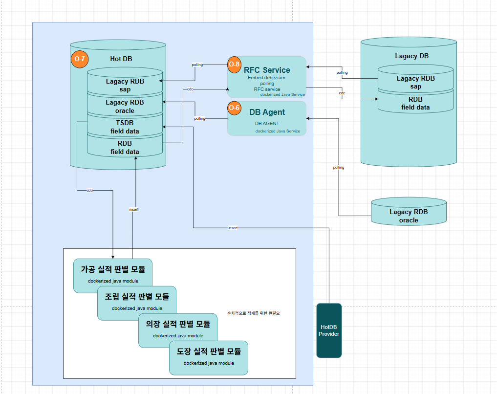

# HotDB — 파란 영역 구현 (Hot DB · 실적 판별 모듈 · RFC Service · DB Agent)

설계 근거는 [`docs/hotdb/BRD.md`](../../docs/hotdb/BRD.md). 구현 설명 · 시나리오 · 측정은
[`hotdb-cdc-implementation.html`](../../docs/hotdb/hotdb-cdc-implementation.html), 표 · 컬럼 · 필드 흐름은
[`hotdb-schema-dataflow.html`](../../docs/hotdb/hotdb-schema-dataflow.html) (브라우저로 연다).



```
field-simulator ─INSERT─▶ [tsdb] ─WAL─┬─▶ zone-mch ─┐                 가공 · 조립 · 의장 · 도장 실적 판별 모듈
 (HotDB Provider 대역)                ├─▶ zone-asm ─┤                 (같은 이미지 × 모듈 수, 모듈마다 슬롯 1)
                                      ├─▶ zone-oft ─┼─▶ [svc]         한 스키마 · module 컬럼 · 행 수준 보안
                                      └─▶ zone-pnt ─┘    │ WAL · svc_cdc_pub = svc.actual_result
                                                         ▼
 SAP (HANA · 로컬은 sap-sim) ◀── Z 표 INSERT ── rfc-provider = RFC Service (실적 CDC → SAP, ops.rfc_sent 로 한 번만)
                             ──JDBC 폴링──▶ rfc-provider ─▶ 레거시 DB [erp]
 Oracle (로컬은 oracle-sim)  ──JDBC 폴링──▶ db-agent = DB Agent ─▶ 레거시 DB [mes · lgs · geo]
      ▲ legacy-simulator (레거시 발행기, 시험용) — sap-sim · oracle-sim 원천 표를 10초마다 UPDATE · INSERT 해 폴링이 가져갈 변경분을 만든다

 Hot DB(필드 DB, 59433) = tsdb · svc · ops      레거시 DB(59435) = erp · mes · lgs · geo · ops.poll_state
```

**서버 to 서버 배치 (2026-10-06 ~)** — Hot DB · 판별 모듈 4 · RFC Service · DB Agent · 발행기 둘 · Prometheus · Grafana 는 **서비스 PC(docker)**,
레거시 DB 사본 · SAP 대역 · Oracle 대역 · 수집기는 **레거시 서버(wssh 172.30.1.88)**. 폴링 둘과 레거시 발행기만 네트워크를 탄다.
올리는 법은 [서버 to 서버](#서버-to-서버).

## 바로 써 보기

```powershell
cd src\hotdb
.\scripts\up.ps1 -Fast        # 빌드 + 전부 기동 (레거시 대역 · 원천 표 시드 포함). -Fast = 스캔 주기 5초
.\scripts\up.ps1 -AllZones    # 발행기가 도장 · 가공 대역 장비 30대씩도 낸다 (필드 정의서 전 가정값)
.\scripts\test.ps1            # 단위 25 + 통합 24 + 대시보드 빈 패널 검사
python scripts\legacy-sim.py mutate   # 레거시 대역 원천 몇 행을 고쳐 증분 폴링 확인
.\scripts\outage-test.ps1     # 권역 서비스를 60초 멈췄다 살려 따라잡는지
.\scripts\down.ps1 [-Volumes] # 내리기 (-Volumes 면 DB · 슬롯까지 초기화)
```

| 무엇 | 주소 |
|---|---|
| Grafana — 첫 화면 **HotDB 상태** (부하 · CDC 판정 정상/주의/이슈), 상세 **HotDB CDC** | http://localhost:59400 (admin/admin) |
| Prometheus | http://localhost:59490 |
| HotDB (필드 DB) | `localhost:59433` db `hotdb` (postgres/postgres) |
| 레거시 DB | `localhost:59435` db `legacy` (postgres/postgres) — erp · mes · lgs · geo · 폴링 상태 |
| 실적 판별 모듈 health | http://localhost:59481 (asm) · 59482 (oft) · 59483 (pnt) · 59484 (mch) `/actuator/health` |
| RFC Service health | http://localhost:59485/actuator/health — 폴링 작업 · CDC 상태 |
| DB Agent health | http://localhost:59486/actuator/health |
| SAP 대역 | `localhost:59434` db `sapsim` (sapsim/sapsim) — 원천 `erpsrc.*` · 송신 대상 `erpsrc.zhotdb_actual_result` |
| Oracle 대역 | `localhost:59521/FREEPDB1` — 원천 표 소유자 MES · LGS · GEO (64표), 읽기 계정 legacy_reader/legacy_reader, 관리자 system/hotdb_sim_sys |
| 발행기 | http://localhost:59480/sim · 배속 `POST /sim/speed?value=5` · `POST /sim/pause` |
| 레거시 발행기 | http://localhost:59493/sim — SAP · Oracle 대역 원천 표를 10초마다 바꿔(UPDATE 3 · INSERT 1) 폴링이 가져갈 변경분을 만든다. 배속 · pause 같음 |

필요한 것: podman (+ docker-compose), JDK 21 (`~/.jdks` 에 있으면 자동), Python 3.
레거시 표(erp 114 · mes 60 · lgs 3 · geo 1 = 178표)는 `scripts/gen-sample-legacy.py` 가 만든 시험용 표다 — 이름 · 컬럼 · 값은 지어냈고, 표 수 · PK · 컬럼 수만 실제 레거시와 비슷하게 맞췄다.

## 구성

| 경로 | 내용 |
|---|---|
| `db/migration/V*.sql` | Hot DB Flyway 마이그레이션 — 계정 · 스키마 · tsdb · publication · 모듈 등록부(V7) · svc 한 스키마(V9) · 레거시 분리(V10) |
| `db/legacy-db/V*.sql` | 레거시 DB — 계정 · 폴링 상태(V1) · 시험용 사본 표 178개(V2, `scripts/gen-sample-legacy.py` 생성) |
| `app/cdc-core` | CDC 포트(`port.CdcSource` 입력 · `port.CdcSink` 출력) · Debezium 어댑터(`adapter.debezium`, `hotdb.cdc.adapter` 로 선택) · 청크 → 하이퍼테이블 역매핑 · 설정 기반 라우팅 · JDBC 반영 |
| `app/poll-core` | 레거시 폴링 라이브러리 — 원천 표 → 레거시 DB 표, 워터마크 증분 · 설정의 작업 목록만 |
| `app/zone-service` | 실적 판별 모듈. **코드 없이 설정(`application.yml` 의 `hotdb.routes`)만 있다**. `ZONE` 으로 모듈 선택 |
| `app/rfc-provider` | RFC Service (O-8) — ① SAP 폴링 → erp (poll-core) ② `svc.actual_result` CDC → SAP. SAP 송신은 `RfcSender` — `jdbc`(Z 표) · `dry-run` |
| `app/db-agent` | DB Agent (O-6) — Oracle 폴링 → mes · lgs · geo 64표 전부 (poll-core). 작업 목록 `poll-jobs.yml` 은 `scripts/gen-sample-legacy.py` 가 만든다 |
| `compose.legacy-sim.yml` · `scripts/legacy-sim.py` | 로컬 검증용 SAP 대역(PostgreSQL) · Oracle 대역(oracle-free 23) · 원천 표 시드 · 레거시 발행기 |
| `app/field-simulator` | 카탈로그 기준 3채널 · 350대 발행기 (×1 ≈ 426 행/초) |
| `app/legacy-simulator` | 레거시 발행기 — 대역 원천 표를 JDBC 메타데이터로 읽어 주기마다 UPDATE(워터마크 = 지금) · INSERT. 운영에서는 안 띄운다 |
| `app/hotdb-migrate` | Flyway 실행기 |
| `compose.*.yml` | 서버 역할별로 나눈 compose — 서버 to 서버 배치 그대로 |
| `monitoring/` | Prometheus · Grafana · postgres_exporter 쿼리 · 경보 |

## 스키마가 바뀌면

1. `db/migration` 에 **새** V 파일을 더한다 (이미 적용된 V 파일은 고치지 않는다 — 체크섬이 바뀌면 Flyway 가 거부한다)
2. 영향받는 라우트의 `columns` 를 `app/zone-service/src/main/resources/application.yml` 에서 고친다
3. `.\scripts\up.ps1` — 마이그레이션이 새 파일만 적용하고, 서비스가 기동 때 라우트를 실제 표와 대조한다

라우트가 표와 어긋나면 서비스는 **어긋난 곳을 전부 모아 보여 주고 기동을 거부한다**(조용히 null 을 쓰며 돌지 않는다):

```
라우트 설정이 DB 스키마와 맞지 않습니다 (2건)
  - 라우트 'status-current': 대상 svc_asm.device_status_current 에 컬럼 humidity 가 없습니다 (있는 것: [...])
  - 라우트 'status-current': 원천 tsdb.status_history 에 컬럼 state 가 없습니다
```

원천 컬럼을 먼저 지우고 서비스를 나중에 배포하는 순서라면 `hotdb.cdc.strict-source: false` 로 원천 쪽은 경고만 낸다.

### 라우트 문법

```yaml
- name: scan                                  # 지표 · dead letter 에 찍히는 이름
  source: tsdb.actual_history                 # 원천 논리 표 (청크 이름은 cdc-core 가 되돌린다)
  lookups: { tag: row.tag_key }               # 참조 캐시 붙이기 → tag.* 로 읽는다
  when: [ "tag.zone=${hotdb.zone.code}", "row.event_type=START|COMPLETE" ]
  target: ${hotdb.zone.schema}.scan
  mode: upsert                                # upsert · insert · insert-on-change · delete
  keys: [ scan_id ]
  newer-than: last_event_at                   # 더 새 이벤트만 덮어쓴다 (재전송 · 순서 뒤바뀜 방어)
  lag-from: row.received_at                   # 지연 지표 기준
  columns:
    first_event_at: row.event_time | keep     # 충돌 시 기존 값 유지
    completed_at: row.event_time if row.event_type=COMPLETE | coalesce
    applied_at: $now                          # DB clock_timestamp()
```

식: `row.x` · `before.x` · `<lookup>.x` · `meta.lsn|op|table|commit_time` · `'상수'` · 숫자 · `null` · `$now` · `식 if 조건`.
조건: `a=v1|v2` · `a!=v` · `a is null` · `a not null`. 값은 `CAST(? AS <대상 컬럼 실제 타입>)` 으로 들어가므로
대상 컬럼 타입을 바꿔도 코드는 그대로다.

새 권역 표 · 새 원천 표도 라우트 한 블록이면 된다. 판별 로직처럼 설정으로 안 되는 것만 서비스에 코드를 더한다.

## 실적 판별 모듈을 더하려면

```sql
-- db/migration/V9__module_cutting.sql  (스키마 · 계정 · 표 5 · 관계 · publication · 등록부)
SELECT ops.provision_module('cut', 'CUTTING', '절단 실적 판별');
```

그다음 `compose.zone.yml` 에 블록 하나(`ZONE: cut`, `ZONE_CODE: CUTTING`)와 `monitoring/prometheus/targets/zone-service.json` 에 주소 하나.
코드 · 라우트는 그대로다 — 모듈마다 규칙이 달라야 하면 `application-cut.yml` 에 그 모듈 라우트만 적는다.
모니터링(`ops.module_apply_lag()`)과 RFC Service 의 CDC(include 정규식 `svc_[a-z][a-z0-9]*`)는 알아서 새 모듈을 센다.

모듈 RDB 안의 표는 FK 로 묶여 있다 — 장비 마스터 ◀ 최신 상태 ◀ 전이, 장비 ◀ 스캔 ◀ 실적 · 산출물.
산출물이 스캔 START 보다 먼저 오면 `scan-stub` 라우트가 부모 자리를 만든다.

> 표 모양이 바뀌는 마이그레이션은 **판별 모듈 · RFC Service 를 먼저 멈추고** 돌린다. 옛 코드가 새 표에 쓰면
> 그 사이 이벤트는 dead letter 로 간다 (2026-10-06 V7 적용 때 1분간 25,050건 — 시험 데이터라 지움).

## 서버 to 서버

### docker 호스트 (Mac · Linux) — 지금 쓰는 배치

```bash
cp .env.example .env            # HOTDB_HOST=hotdb-pg(이 PC 에 Hot DB 도) · LEGACY_HOST=<레거시 서버 IP> · SAP_URL · ORACLE_URL · LSIM_LOCAL
scripts/up-services.sh          # jar 빌드 → 이미지 빌드 → Hot DB + 마이그레이션 → 판별 모듈 4 · RFC Service · DB Agent · 발행기 · 모니터링
scripts/up-services.sh --skip-build | --no-legacy | down [-v] | ps | logs [svc]
```

| 스크립트 | 하는 일 |
|---|---|
| `scripts/up-services.sh` | 서비스 PC 쪽 전부. `.env` 의 HOTDB_HOST 가 `hotdb-pg` 면 Hot DB 도 같이 띄우고 마이그레이션이 끝난 뒤 서비스를 올린다. Prometheus `targets/*.json` 을 `.env` 의 서버 주소로 다시 쓴다. `LSIM_LOCAL=1` 이면 레거시 발행기도 이 PC 에서 |
| `scripts/make-legacy-bundle.sh` | 레거시 서버용 묶음 `dist/legacy-bundle/` (+ `.tar.gz`) — compose 셋 · 마이그레이션 SQL · 시드 · hotdb-migrate · legacy-simulator 이미지(amd64 · arm64) · `up.sh`/`up.ps1` · README. 저쪽은 docker(또는 podman) + python3 만 있으면 `./up.sh` 한 번 |
| `scripts/deploy-hotdb.sh` | Hot DB 를 다른 서버에 둘 때 — SSH 로 compose.db.yml · db · monitoring · jar 를 보내고 거기서 build · up |
| `scripts/legacy-sim.py` | 대역 원천 표 시드 · 한 번 고치기. podman 없으면 docker 를 쓴다 (`CONTAINER_CLI`) |

docker 에서는 podman-exporter 대신 `cadvisor`(59492) 를 띄운다 — rules 의 `hotdb:container_*` 가 둘을 같은 이름으로 묶어 대시보드는 그대로다.
호스트 지표(node-exporter)는 macOS 에서는 Docker Desktop VM 을 본다 (RAM 이 VM 할당량으로 나온다).

레거시 서버의 포트(59434 · 59435 · 59521 · 59489 · 59491 · 59492 · 59493)가 서비스 PC 에서 열려 있어야 한다. 레거시 발행기 · 필드 발행기는
`GET /sim` · `POST /sim/speed?value=N` · `/sim/pause` · `/sim/resume` 으로 조절한다 (레거시 발행기는 `/sim/tick` 도).

### podman 호스트 (서버마다 compose 하나) — 원안

| 서버 | 띄우는 것 |
|---|---|
| HotDB 서버 | `podman compose -f compose.db.yml up -d` + `-f compose.monitoring.yml up -d podman-exporter node-exporter` |
| OT 서버 A/B | `.env` 에 `HOTDB_HOST=<HotDB IP>`, `HOTDB_PORT=59433` → `podman compose -f compose.zone.yml up -d zone-asm` (또는 zone-oft) + 수집기 둘 |
| RFC AGENT 서버 | 같은 `.env` + `SAP_URL` · `SAP_USER` · `SAP_PASSWORD` · `SAP_SCHEMA` · `RFC_SENDER=jdbc` → `podman compose -f compose.rfc.yml up -d` |
| DB AGENT 서버 | 같은 `.env` + `ORACLE_URL` · `ORACLE_USER` · `ORACLE_PASSWORD` · `ORACLE_SCHEMA` → `podman compose -f compose.agent.yml up -d` |
| 발행기 (아무 곳) | 같은 `.env` → `podman compose -f compose.sim.yml up -d` |
| 모니터링 | `podman compose -f compose.monitoring.yml up -d prometheus grafana` → `monitoring/prometheus/targets/*.json` 에 각 서버 `IP:포트` |

이미지는 한 곳에서 `podman compose ... build` 후 `podman save` / `load` 로 옮긴다.
지연은 DB 시계만으로 잰 값(`hotdb_zone_apply_lag_*`)을 기준으로 본다 — 서버 간 시계 편차가 섞이지 않는다.

### 운영 안전장치 (2026-10-06 서버 to 서버에서 겪고 넣은 것)

- **서비스는 Hot DB 없이 죽지 않는다** — 기동 때 `DbReadyGate` 가 `SELECT 1` 이 될 때까지 5초마다 기다린다(`hotdb.cdc.db-wait`). 전에는 DB 가 내려가 있으면 컨텍스트가 실패해 컨테이너가 재시작을 반복했다
- **슬롯 WAL 상한 20GB** (`max_slot_wal_keep_size`, `HOTDB_SLOT_WAL_KEEP`). 발행기 ×10 을 20분 돌리자 rfc_provider 슬롯이 12GB 뒤처져 10GB 상한에 무효화됐다(`wal_status=lost`). 무효화되면 슬롯 · `ops.cdc_checkpoint` · 오프셋을 지우고 다시 붙여야 하고, RFC Service 는 `svc.actual_result` 를 처음부터 스냅샷해 안 보낸 것만 보낸다(`ops.rfc_sent` 가 거른다)
- 한 대(Mac)에서는 **×3~×5 까지**가 안전하다. 올릴 때 Grafana "슬롯 최대 보존 WAL" 과 경보 `CdcSlotRetainingWal` 을 본다

## 처음 잰 값 (2026-10-06, 로컬 podman VM 2GiB · 권역 서비스 2개)

| 배속 | tsdb 적재 | 서비스당 CDC 수신 | 반영 지연 p99 (DB 시계) | PG CPU | 서비스 CPU (각) | 서비스 메모리 (각) |
|---|---|---|---|---|---|---|
| ×1 | ≈ 400 행/초 | ≈ 400 ev/s | 0.17 ~ 0.34초 | — | — | — |
| ×5 | ≈ 1,960 행/초 | ≈ 2,000 ev/s | 0.25 ~ 0.30초 | 0.26 코어 | 0.22 코어 | ≈ 420 MB (힙 상한 256MB) |

- 권역 서비스는 자기 권역만 쓰지만 **tsdb 전체 WAL 을 받는다** (asm · oft 둘 다 2,000 ev/s). 서비스가 늘면 walsender 부하가 그만큼 는다 — BRD §05.4
- 장애: 권역 서비스 45초 정지 → 슬롯 미확인 WAL 18MB → 재기동 8초 만에 따라잡음, 누락 · dead letter 0
- 한 대 안에서 잰 값이라 네트워크가 빠져 있다. 서버 to 서버 값은 R1-b 에서 다시 잰다

### 2단 CDC 를 붙인 뒤 (2026-10-06, `-Fast` = actual 5초 주기라 행/초가 ×1 기준의 약 3배)

| 배속 | tsdb 적재 | WAL | walsender CPU (슬롯당) | 권역 서비스 CPU (각) | rfc-provider 수신 · CPU | PG CPU | 2단 지연 (반영 → 송신) |
|---|---|---|---|---|---|---|---|
| ×1 | ≈ 1,170 행/초 | ≈ 1.0 MB/s | 0.009 코어 (rfc 0.007) | 0.17 코어 | 10 ev/s · 0.02 코어 | 0.21 코어 | 평균 0.28초 · 최대 0.56초 |
| ×3 | ≈ 3,680 행/초 | ≈ 2.9 MB/s | 0.04 코어 (rfc 0.019) | 0.52 코어 | 33 ev/s · 0.05 코어 | 0.61 코어 | 평균 0.31초 · 전 구간 최대 3.5초 |

- rfc_provider 슬롯은 publication 으로 1% 만 받는데도 walsender CPU 가 권역 슬롯의 절반이다 — **논리 디코딩은 publication 과 상관없이 슬롯마다 전체 WAL 을 읽는다**
- 비용의 대부분은 HotDB 가 아니라 소비자 JVM 쪽이다 (모든 이벤트를 받아 JSON 을 풀고 권역 밖 것을 버린다)

## 알아 둘 것

- 발행기는 HotDB Provider 대역이다. Provider(MQTT Agent → tsdb)는 파란 영역 밖이라 만들지 않는다
- 서비스는 Hot DB 가 없으면 **죽지 않고 기다린다** — 기동 때 `SELECT 1` 이 될 때까지 5초마다 시도(`hotdb.cdc.db-wait`), 30초마다 로그. DB 가 오면 그때 라우트 대조 · 슬롯 검사 · 엔진 기동. 라우트가 스키마와 안 맞는 것은 그대로 기동 거부다
- 레거시 폴링은 워터마크(`upd_date || upd_time`) 이상만 다시 읽는다 — 같은 값의 행은 매번 다시 읽히지만 UPSERT 라 결과가 같다.
  작업 상태는 `ops.poll_state`, 멈추면 경보 `LegacyPollStale`
- SAP 송신을 JCo(RFC 함수)로 바꿀 때는 `RfcSender` 구현 하나만 더한다 — CDC · 중복 차단(`ops.rfc_sent`) · 재시도는 그대로
- 압축 정책은 7일 뒤에 건다. 압축은 원본 행을 이벤트 없이 비우므로, 소비자가 7일 넘게 멈추면 그 구간은 CDC 로 안 나온다
- 슬롯은 서비스가 처음 붙을 때 만든다. 서비스를 영영 안 쓸 거면 슬롯을 지워야 WAL 이 풀린다 (모듈째 걷어낼 때는 `ops.drop_module` 이 슬롯 · 체크포인트까지 지운다):
  `SELECT pg_drop_replication_slot('zone_pnt');`
- `svc_cdc_pub` 에는 `actual_result` 만 싣는다 (V6). 다른 표를 SAP 로 보내야 하면 V 파일로 더한다
- RFC Provider 는 실적 키 + 판정 상태당 한 번만 보낸다(`ops.rfc_sent`). SAP 가 내용으로 거절하면(`RfcRejectedException`) dead letter, 접속 장애는 재시도 후 재시작 — 오프셋이 안 넘어가 빠지는 실적이 없다
- 오프셋 볼륨(`zone-*-data`)을 지워도 슬롯이 살아 있으면 유실은 없다 — 슬롯의 confirmed_flush 위치부터 다시 받는다

### CDC 안전장치 (이전 Java 판 embedded-cdc · latest-poc 에서 옮김)

| 무엇 | 동작 | 볼 곳 |
|---|---|---|
| 캡처 갭 검사 | 처리 위치를 `ops.cdc_checkpoint` 에 배치마다 남기고, 기동 때 슬롯과 대조한다. 슬롯이 없거나 · 무효화됐거나 · 처리 위치보다 앞을 버렸으면 **엔진을 띄우지 않고** 프로세스는 살려 둔다 | health DOWN · `hotdb_cdc_capture_gap=1` · 경보 `CdcCaptureGap` (앱이 안 떠도 `CdcCaptureGapByLsn`) |
| 실패 판정 | SQLSTATE 로 셋 — 일시 장애는 재시도, 데이터 문제는 그 건만 dead letter, 구조 문제(표 · 컬럼 · 권한)는 **멈춤** | `hotdb_cdc_state=4`(HALTED) · 경보 `CdcPipelineHalted` |
| dead letter 비율 정지 | 건 단위로 좁혔는데 10건 이상 · 절반 넘게 실패하면 구조 문제로 보고 멈춘다 (dead letter 가 전체를 삼키지 않게) | `hotdb_cdc_pipeline_halts_total{reason="DLQ_RATIO"}` |
| 해석 실패 격리 | 원천 레코드를 못 읽으면 엔진을 죽이지 않고 원문째 dead letter (`route = '(decode)'`) | `ops.cdc_dead_letter` |
| dead letter 재처리 | 원인을 고친 뒤 `UPDATE ops.cdc_dead_letter SET status = 'RETRY_REQUESTED' WHERE id = …` 하면 30초 안에 다시 반영. 더 새 값이 이미 있으면 덮지 않고 `STALE_SKIPPED` | `status` · `resolution` 컬럼 |

멈춘 뒤에는 원인을 고치고 재기동한다 — 위치를 넘기지 않았으므로 멈춘 배치부터 다시 받는다.
캡처 갭은 WAL 로 되받을 수 없으므로 대상 표를 다시 맞춘 뒤 다음을 하고 재기동한다:

```
podman exec hotdb-zone-mch rm -f /app/data/offsets-zone-mch.dat
psql: DELETE FROM ops.cdc_checkpoint WHERE pipeline = 'zone-mch';
```
